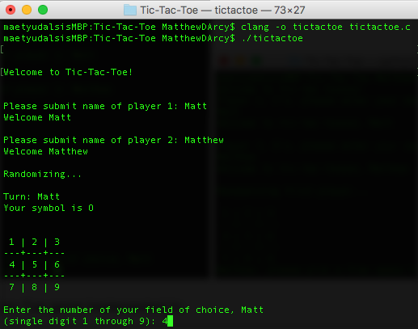
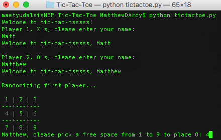

# Tic-Tac-Toe

---

A two-player Tic-Tac-Toe game implemented in:
1. C

2. Python

**Features**

* (C) Random assignment of X/O's
* (C, Python) Random player order
* (C, Python) Continuous play

**To Play**

* C (Mac) - With XCode installed on your machine, navigate to directory of TicTacToe.c in terminal
  > clang -o tictactoe tictactoe.c
  > ./tictactoe

* C (Windows/Linux) - Navigate to directory of TicTacToe.c in prompt/terminal
  > gcc -o tictactoe tictactoe.c
  > ./tictactoe

* Python - With Python installed on your machine, navigate to the directory of TicTacToe.py
  > python BlackJack.py

---

© 2015 [Matt D'Arcy](http://linkedin.mathewdarcy.com), shared under the [MIT License](http://www.opensource.org/licenses/MIT).
